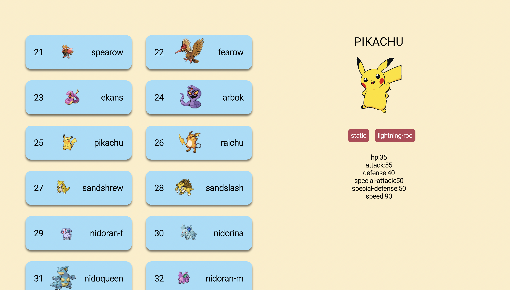

# Sandys Pokedex
To visit the site and see your favorite Pokemon: https://sandys-pokedex.netlify.app/

This is a modern-design Pokedex page that lists all pokemons currently in the [Pokedex API](https://pokeapi.co/).

There are a series of cards that when, clicked on, display an image and information about the pokemon on the right.

## Built With

 # How to Use

To see a pokemon's information simply click on its card on the left. The information displayed includes:

- Health Points
- Attack Damage
- Signature Moves
- Speed Rating

and more!

To go to the next or previous page of pokemon, click on the "Next" or "Back" buttons on the bottom of the page.

#
## Coming Soon

Features to be added in the future include but are not limited to:

- [ ] Pokemon sound effects when clicked on
- [ ] Search bar to filter through pokemons
- [ ] Dark mode option

